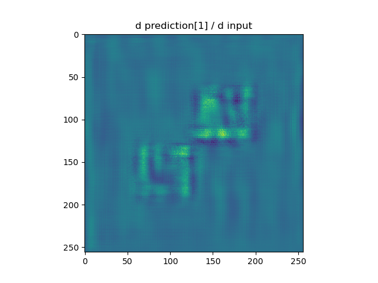

# aug-net
A small tutorial on how to calculate the Jacobian of the outputs wrt the inputs


# 1. Introduction

Consider the case that you have a regression or a classification problem for which you have trained a neural network. Let's say the you have chosen the network well and it learns to predict the results correctly for training set! Is that enough, of course not! You have check the performance on the dev set, to make sure that you are not overfitting. You can go one step further in checking the performance of the network by using a test set, which is used only after all the experiments you did with your network.

Is that it? Can I know more about the performance of my model? Can I know what my model has learned?

Answers to these questions, partially, fall into explainable AI (XAI) where one attempts at figuring out the quality of an AI solution. One starting point to this analysis, can be asking the following questions:

"what is the sensitivity of my predictions to different elements of the input?". For example, let's say I have a cat/dog classifier, and it predicts that in the current image there is a dog. The above question translates to "changing which pixels has the most dramatic effect on the prediction and which picxels are not that important?". As you can see, this is going to give us some understanding of what our network has learned!


The sensitivity mention there has a technical term in mathematics; it is referred to as the Jacobian. Here, we augement a common keras DNN model with a method which return the Jacobian.

# 2. Installation
One can install the requirements by 

```
pip install -r requirements.txt
```

and you might need to install the current package locally by:
```pip install -e .```
# 3. How to use it?
There are two modes that you can use the current package and get the Jacobians:
* One way is to create a new instance of
AugNet and train it, 
* the other way is to load an existing (trained) model and convert it to an AugNet. This model could be either an 
instance of AugNet or a Keras model.

In both scenarios, after train or loading, you can access the Jacobians by the method ```return_jacobian```.
## 3.1. How to create/train/use a AugNet from scratch?
In the file, ```create_train_and_utilize.py```, a neural network is created, trained, and then its Jacobian is calculated for a test input. In general:
* You have to first create a neural network as you usually do in Keras, but this time you use ```AugNet``` instead of ```keras.Model``` for compilin your model. ```AugNet``` is our subclass of keras.Model.
* Training is done via ```fit``` method of Keras as commonly done in TensorFlow.
* Access the Jacobian via ```return_jacobian``` method, e.g. ```my_model.return_jacobian()```

For a fully functioning example refer to the python script [create_train_and_utilize.py](create_train_and_utilize.py).
## 3.2. How to load a trained (Keras) model?
One first needs to load the trained model as it is, commonly done by:
```python
trained_model = keras.models.load_model(trained_model_dir)
```
After that the trained model is loaded, one can create an instance of AugNet with exactly same network structure and
parameters:
```python
model = AugNet(inputs=trained_model.inputs, outputs=trained_model.outputs)
```

Now ```model``` is an AugNet instance and its Jacobians can be accessed via ```return_jacobian``` method. 

For a fully functioning example refer to python script [load_a_trained_model.py](./load_a_trained_model.py).

# 4. Computational efficiency
Here we compare two methods of calculation of Jacobian in terms of their computational cost.

A simple method to calculate the Jacobian is to change each input value separately
and observe the changes in the outputs. From these changes one can easily calculate the corresponding components of the Jacobian.
The computational cost of such calculation for all the components of the jacobian is equal to the
computational cost of one function evaluation multiplied by the dimensionality of inputs. 

Let's estimate the time of such a calculation for the case that the network get a 256 x 256 image and calculates
13 scalar outputs from it. The estimated time of one evaluation of the network is roughly 0.5 sec, and the dimensionality of
the input is 256 x 256. For such a setup the naive way of estimating the Jacobian takes 0.5 (sec) x 256 x 256 ~ 9 hours.

Another approach to calculate the jacobian is by utilizing the automatic differentiation which is  readily offered by 
the deep learning frameworks like tensorflow. This is also the approach that we took in this work. Given that the deep learning
frameworks heavily rely on automatic differentiation and this process is optimized, we expect that the computational
cost of the Jacobian calculation would be of the same order of magnitude as the forward execution of the neural network
(i.e. as one prediction). To verify this, we empirically measured the required time for the Jacobian calculation. 
For the above mentioned example, the time required for the Jacobian calculation drops from **9 hours to 2.5 secs**, which is a dramatic 
reduction.

Some parts of the calculated Jacobian is presented in the following images.

For the input, which is 256 x 256 image, the Jacobian is made of 13 images of the same size. Here we show 
the input image and some of the corresponding components of its jacobian.

The input:


Three (out of thirteen) images which builds the Jacobian. 





